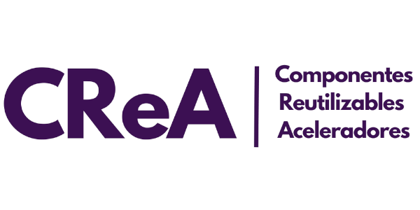

# GoLang archetype

Proyecto para generación automatica de un microservicio con Go y MySQL

## Requisitos

* [Instalar GO LTS](https://go.dev/doc/install)
* [Instalar NodeJs LTS](https://nodejs.org/es/)
* Instalar Yeoman
    `npm install -g yo`


## Configuración

- Instalar las dependencias de GO:

Asegúrate de tener instalado lo mencionado en la sección de Requisitos. Necesitarás instalar las siguientes dependencias:
```
go get -u github.com/gin-gonic/gin

go install github.com/swaggo/swag/cmd/swag@latest
go get -u github.com/swaggo/gin-swagger
go get -u github.com/swaggo/files
```

- Vinculación Yeoman:

Es necesario movernos a la carpeta de *Generator\generator-goArchetype\* para lanzar los siguientes comandos

```
# Descarga de dependencias
npm install

# Link de el yeoman con el arquetipo
npm link
```

Con esto tendremos en el yeoman nuestro arquetipo para generar

Nota: En el archivo *config.json* que se encuentra en la carpeta *generators/app* puede configurar los parametros para el nombre de la compañia, nombre del proyecto (entidad) y puerto

```json
{
  "company": "Axity",
  "name": "User",
  "port": 9091
}
```
- Estructura de tabla:

Este arquetipo utiliza una base de datos MySQL y debe tener una estructura como esta para ser generada:

```sql
CREATE TABLE clients (
    id BIGINT AUTO_INCREMENT PRIMARY KEY,
    name VARCHAR(255) NOT NULL,
    last_name VARCHAR(255) NOT NULL,
    created_at DATETIME DEFAULT CURRENT_TIMESTAMP,
    updated_at DATETIME DEFAULT CURRENT_TIMESTAMP ON UPDATE CURRENT_TIMESTAMP,
    deleted_at DATETIME DEFAULT NULL
);
```

El nombre de la tabla deberá ser igual al campo "name" en el *config.json* mencionado previamente, en minúsculas.

## Estructura
Organiza tu proyecto siguiendo una estructura de Clean Architecture como la de este arquetipo:
```
/application
├── config
│   ├── configuration.go
│   ├── configuration_test.go
│   ├── user_config.go
│   └── user_config_test.go
├── controllers
│   ├── user_controller.go
│   └── user_controller_test.go
├── docs
│   ├── docs.go
│   ├── swagger.json
│   └── swagger.yaml
├── dtos
│   ├── input
│   │   ├── create_user_in.go
│   │   └── update_user.go
│   └── output
│       ├── create_user_in.go
│       ├── delete_user_in.go
│       ├── get_user_in.go
│       ├── get_users_in.go
│       └── update_user_in.go
├── facade
│   ├── impl
│   │   ├── user_facade_impl.go
│   │   └── user_facade_impl_test.go
│   └── user_facade.go
├── models
│   ├── user.go
│   └── user_test.go
├── persistence
│   ├── contexts
│   │   └── database.go
│   └── repositories
│       ├── impl
│       │   ├── user_repository_impl.go
│       │   └── user_repository_impl_test.go
│       ├── gorm_repository.go
│       └── user_repository.go
├── services
│   ├── impl
│   │   ├── user_service_impl.go
│   │   └── user_service_impl_test.go
│   └── user_service.go
├── utils
│   └── constants.go
├── DockerFile
├── go.mod
├── go.sum
└── main.go

```

## RUN Application
Para generar el arquetipo y correr la aplicación debemos ejecutar lo siguiente

- Creación de arquetipo:

Dirigete a la carpeta donde deseas crear tu arquetipo y ejecutas:

```
yo goArchetype
```

Con esto has generado tu proyecto.

- Edición de variables de entorno

Para asegurarte que funcione correctamente tu proyecto, debes dirigirte al archivo .env generado y debe aparecer algo como

```
DB_USER=YourDBUser
DB_PASSWORD=YourDBPassword
DB_NAME=YourDBName
DB_PORT=127.0.0.1:3306
DB_TABLE=users
APP_PORT=9091
```
En ese archivo debes poner tus credenciales y detalles para conectarte apropiadamente a tu base de datos 

- Levantar la aplicación:

Finalmente puedes levantar el proyecto con los siguientes comandos

```
swag init
go run .
```
## Docker

Ejecutar la aplicación de Docker es sencillo, asegúrate de estar a la altura de la carpeta de tu archivo generado Dockerfile.


Para generar tu imagen solo debes introducir 
```
docker build --build-arg APP_PORT=9091 -t my-container-name .
```
Especificando en el APP_PORT el puerto donde quieres levantar el servicio

Y para ejecutar el contenedor debes ejecutar
```
docker run -p 9091:9091 my-container-name
```
Especificando el mismo puerto que al generar la imagen.

Nota: Si quieres levantar desde una base de datos local, tu archivo .env se debaría ver algo así antes de generar la imagen:

```
DB_USER=YourDBUser
DB_PASSWORD=YourDBPassword
DB_NAME=YourDBName
DB_PORT = host.docker.internal:3306
DB_TABLE=users
```
Igual es importante retirar del archivo el atributo APP_PORT para que no entre en conflicto con docker


## Comandos útiles

* mod tidy: 
Asegura que el go.mod tenga los requerimientos necesarios para levantar el proyecto
```
# Ensures that the go.mod file matches the source code in the module.
go mod tidy 
```
Reference https://go.dev/ref/mod#go-mod-tidy

* test -coverprofile: 
Te ayuda a visualizar de manera más sencilla la cobertura de tus pruebas  

```
go test -coverprofile coverage.out ./...
go tool cover -html coverage.out
```

## Autores
* Luis Leonardo Fuentes (luis.fuentes@axity.com)
* Jesus Alejandro Hernandez (jesus.hernandezm@axity.com)

